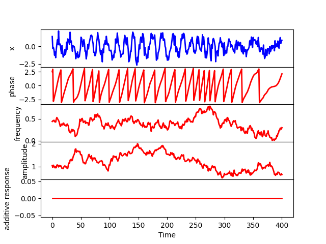
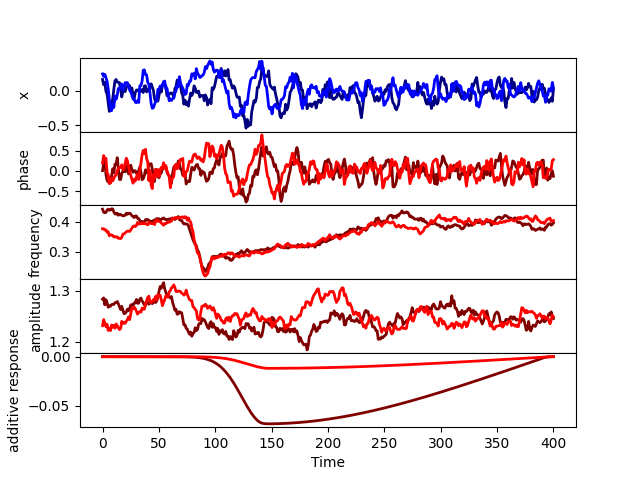
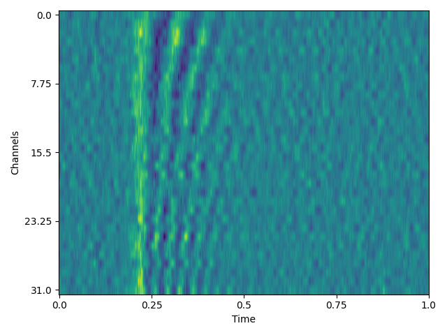

Graphics
========

The toolbox provides a few unsophisticated functions, mainly to plot
the sampled data and the decoding results. 

To plot the signals together with the components that made it up, 
there is the method ``graphics.plot_signal()``,
which can take as arguments

* ``X``: the data
* ``Phase``: the phase of the ongoing oscillation
* ``Freq``: the frequency of the ongoing oscillation
* ``Amplitude``: the amplitude of the ongoing oscillation (the square root of the power) 
* ``Additive_response``: the sum of the additive responses
* ``Stimulus``: the array of stimuli
* ``n``: the index of the trial to plot
* ``j``: the index of the channel to plot

   
   graphics.plot_signal(X,Phase,Freq,Amplitude,Additive_response,None,n=0,j=0)

Any of the second to sixth argument can be omitted ot set to None,
and it will be skipped.  
Note that phase, frequency and amplitude refer to the ongoing (possibly phase reset)
signal, before any additive response or measurement noise is added. 
An example of this function can be seen above. 

To plot an average evoked response for a given channel, we can use the method
``graphics.plot_erp()``, with arguments

* ``Stimulus``: the array of stimuli, which has to be categorical (see above)
* ``X``: the data
* ``Phase``: the phase of the ongoing oscillation
* ``Freq``: the frequency of the ongoing oscillation
* ``Amplitude``: the amplitude of the ongoing oscillation (the square root of the power) 
* ``Additive_response``: the sum of the additive responses
* ``j``: the index of the channel to plot

   
   graphics.plot_erp(Stimulus,X,Phase,Freq,Amplitude,Additive_response,j=0) 

To plot the TGM or time-point-by-time-point decoding accuracies,
there is the method ``graphics.plot_accuracy()``,
which takes the accuracy as given by ``decoder.decode()`` and 
the colour limits (only used if a TGM is provided).
If we performed decoding for more than 2 classes,
then we should index the pair of conditions that we wish to plot
out of the ``(Q*(Q-1)/2)`` pairs: 

.. figure:: figs/accuracy.png
   :scale: 50 %
   
   graphics.plot_accuracy(accuracy[:,:,1],(0.3,0.7))

We can also plot the decoding coefficients (the betas) using ``graphics.plot_betas(betas)``: 

   
   graphics.plot_betas(betas)

Finally, we can plot the activation functions to see how the parameters 
affect their shape. For this we can use ``graphics.plot_activation_function()``
with parameters

* ``kernel_type``: e.g. ``('Exponential','Log')``,
* ``kernel_par``: e.g. ``(25,(10,150,50)``,
* ``T``: number of time points in the trial
* ``t``: when the stimulus occurs? 
* ``delay`` of the response
* ``jitter`` in the delay. 

For more information about kernel parameters and delays, as well as examples, see above. 
 