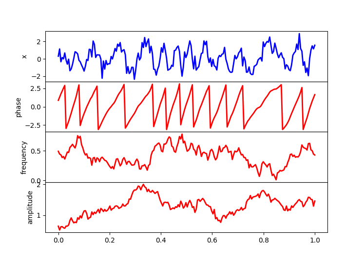

Generating Resting state data
=============================

Although the main purpose of the toolbox is to generate data under stimulation, it can also be used
to generate resting-state activity (i.e. with no stimulation).  The resting-state data is also the basis
to generate data under stimulation, as will be described later. 

To generate data we need to specify two dictionaries of options, one regarding the ongoing activity,
and another regarding the task activity.
In the task activity one, we can specify which types of task effects we will have;
we will specify all types to be off: 

.. code-block:: console

    evoked_options_empty = {
        "phase_reset": False, 
        "amplitude_modulation": False, 
        "additive_response": False,
        "additive_oscillation": False}

Ongoing, resting-state data have spontaneously time-varying amplitude and frequency. 
Note that we use amplitude in the sense of the square of power, 
i.e. it does not contain phase information. 
Specifically, the spontaneous, instantaneous amplitude and frequency evolve separately from each  
other, according to some random walk (specifically, an autoregressive process of order 1).
More specifically, the dynamics of the time series depend on the
parameters ``AMP_AR_W`` (for amplitude) and ``FREQ_AR_W`` (for frequency).
These are positive values equal or lower than 1.0. 
The closer to 1.0 are these values, the smoother and slower are the variations;
on the other hand, lower values will result in more abrupt changes, as
the autocorrelation of the frequency/amplitude time series becomes lower. 

The other relevant parameters are ``FREQ_RANGE`` and ``AMP_RANGE``.
Both are tuples of two numbers indicating the lower and higher 
values that frequency and amplitude can take (i.e. their range of values). 
That is, after sampling the frequency and amplitude time series, 
these will be rescaled to lie within the limits of 
``FREQ_RANGE`` and ``AMP_RANGE``, respectively.
Frequency is expressed as angular frequency, 
so it is independent of the sampling frequency of the data. 
Amplitude is given here as a multiplying factor, so if the amplitude value at a given time point is 2.0,
then this doubles the signal's default amplitude, whereas, if it is 0.5, it halves it.  

Also, there is measurement white noise,
with standard deviation specified by the parameter ``MEASUREMENT_NOISE``.

The dictionary with the options for the rest data could be something like: 

.. code-block:: console

    spont_options = {
        "FREQ_RANGE": [0.01, math.pi/4], 
        "AMP_RANGE": [0.5, 2],
        "FREQ_AR_W": 0.95},
        "AMP_AR_W": 0.99,
        "MEASUREMENT_NOISE": 0.5
        }

To create the sampler object, we call the ``DataSampler`` construct, with parameters:

1. Number of time points within a trial.
2. Number of channels
3. Number of classes/stimuli (in this case None)
4. The dictionary with the options for the ongoing activity
5. The dictionary with the options for the task effect (in this case with effects off)

Then we can call the method ``sample`` with one parameter which is the number of trials.
Note that we can get continuous data just by setting ``T`` equal to the total number of time points
in the session and ``N=1``. 
Altogether: ::

    ds_rest = sample_data.DataSampler(T,nchan,None,spont_options,evoked_options_empty)
    (X,Phase,Freq,Amplitude,Additive_event,Stimulus) = ds_rest.sample(N) # N trials

The method ``sample()`` returns six different time series, all numpy arrays 
of dimension (time by trials by channels), excepting ``Stimulus`` 
(which is time by trials; see below).

* ``X``: The signal
* ``Phase``: The phase of the signal 
* ``Freq``: The instantaneous frequency of the signal
* ``Amplitude``: The amplitude of the signal (square root of the power)
* ``Additive_response``: The additive (non-oscillatory plus oscillatory) response
* ``Stimulus``: The stimulus information

Note that phase, frequency and amplitude refer to the ongoing (possibly phase reset)
signal, before any additive response or measurement noise is added. 
For one channel and one trial, an example of these time series looks like:
 

   Generated time series (blue), decomposed by phase, instantaneous frequency 
   and instantaneous amplitude (red).

Note that the channel signals are separately sampled one by one, 
so, in the absence of stimulation, there is no dependences between them (asymptotically).
Optionally, we can can specify a "head model" in the form of a 
(number of channels by number of sensor) numpy matrix,
so that we can project the time series into a higher-dimensional 
"sensor space" with correlations between the time series: 

.. code-block:: console

    X_sensor_space = ds_rest.project(X,head_model)
    Phase_sensor_space = ds_rest.project(Phase,head_model)
