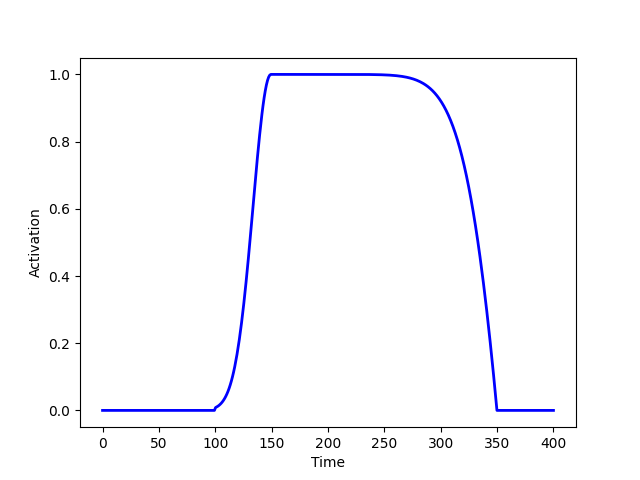
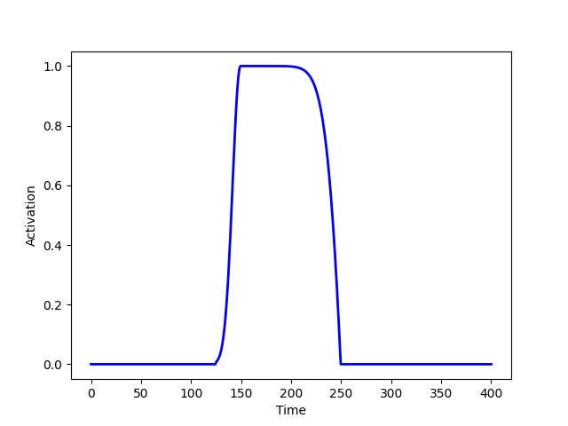
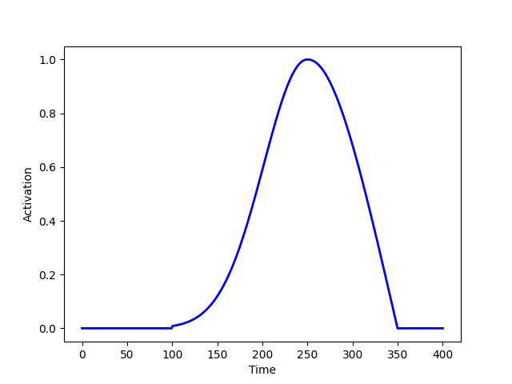

Generating task data
====================

Up until now, we have sampled data with spontaneous dynamics under no stimulation. 
We now show how to generate the different kind of effects that a stimulus *could* produce. 
From now on we will use the terms condition and stimulus indistinctly.
("Stimuli" is actually just as a convention here; 
for the sake of this generative model,
this is a perturbation of the system that could also be because of an action or a decision). 
We will assume there are *Q* different conditions. 
Then, we will see how the synthetic data look through the lens of decoding analysis,
where we aim at finding discriminative subpaces between the conditions in the data.
The generated effects can be condition-specific,
i.e. the way we generate the signals is dependent on the condition,
so that a decoder can use this information for prediction;
or occur across conditions, 
so that the generative process is not specific of the condition, 
but still may modulate the behaviour of the decoder.
The possible effects are:  

* A phase effect, composed of phase-resetting to a condition-specific target phase and 
  then frequency entraining to a certain target frequency.
* An amplitude increase on the ongoing oscillation (with no phasic alteration) 
  by a (possibly stimulus-specific) factor, following stimulus presentation. 
* A set of additive non-oscillatory responses with condition-specific signal values.
* An additive oscillatory responses with condition-specific phase, frequency and amplitude. 

To activate one or more of the three type of effects, we will use the dictionary keys
``phase_reset``, ``amplitude_modulation``, ``additive_response`` and ``additive_oscillation``,
which can take ``True`` or ``False`` values. 

The temporal aspects of these effects is regulated by response functions, 
which determine how the effects progressively build up, reach a maximum, and then wane off. 
This is explained below. 
Also, we can control the delays (how long it takes to respond after stimulus presentation) 
per channel (relative delays) 
or across channels (absolute delays).
This can be subject to between-trial noise or not; see also below. 

Also, whether each channel responds to stimulation or not
(i.e. whether it activates) is stochastic.
To adjust the probability of activation, we use the dictionary key ``CHAN_PROB``, 
which can take a single value if we want
all the channels to have the same probability of activation, or 
a numpy 1D array with as many elements as channels (with one probability per channel).
If we wish to experiment with the effect of having irrelevant channels on the decoding, 
we can just set some values of ``CHAN_PROB`` to 0.0. 

An example of task data can be generated as 

.. code-block:: console

    chan_prob = np.zeros(nchan)
    chan_prob[0:round(nchan/2)] = 1/4

    evoked_options = {
        "phase_reset": True, 
        "amplitude_modulation": True, 
        "additive_response": False,
        "additive_oscillation": False,
        "CHAN_PROB": chan_prob
        }    

    ds_task = sample_data.DataSampler(T,nchan,None,spont_options,evoked_options)
    (X,Phase,Freq,Amplitude,transient_event,stimulus) = ds_task.sample(N)

The four effects, together with channel probability activation, 
the delays, and the different response functions, 
create a plethora of possibilities of how to generate stimulus-specific effects on the ongoing signal.
In the `accompanying paper <http://biorxiv.com>`_, 
we have non-exhaustively explored a few of these combinations,
and seen that some combinations will match the characteristics of real data better than others. 
We next describe how to parametrise the three effects: phase, amplitude and additive responses. 

Phase effects
-------------

A phase effect first produces a phase reset of the ongoing oscillation, 
and, once it hits the target phase, 
it entrains at a certain frequency for some time.
To have a phase effect, we have to specify ``phase_reset=True`` 
in the task options dictionary.

The phase at which channels reset is given by sampling from a von Mises distribution 
(the circular version of the Gaussian), 
where the sampling is done per trial. 
The mean of this distribution is given by the dictionary key ``PH``, 
which can be a numpy 2D array with dimension
(``Q`` by channels —where ``Q`` is the number of conditions) or 1D with ``Q`` elements 
(such that all channels reset to the same phase on average).
If ``PH`` is not specified, then the key ``DIFF_PH`` will be used to generate ``PH``.
Then, the condition mean phases will be spanned 
within a range (-0.5 ``DIFF_PH``, +0.5 ``DIFF_PH``)
For example, if ``DIFF_PH=``:math:`{\pi}` (the default value) and there are *Q=2* conditions, 
then the mean phase of the first condition will be :math:`-0.5 {\pi}` 
and the mean phase of the second condition will be
:math:`+0.5 {\pi}`. If there are ``Q=3`` conditions, then the first is :math:`-0.5 {\pi}`, 
the second is 0.0, and the third is :math:`+0.5 {\pi}`.
In general, :math:`{\pi}` is the largest value this parameter can take, 
since that is the maximum angular distance;
lower values than :math:`{\pi}` will make the decoding problem harder because the conditions' 
phase distributions will be more overlapping. 

The standard deviation of the phase distribution (at which channels reset) 
will determine how noisy is the phase resetting.
The standard deviation is given by the key ``STD_PH``, which is equal for 
all channels and conditions, 
and takes the value 0.1 by default. 
Larger values will will make the decoding problem harder, 
because it will also make the phase distributions to overlap more. 

Now, once a channel hits its target phase, it will entrain 
at a certain frequency for some time. 
This is parametrised by two options, ``FREQUENCIES_ENTRAINMENT`` and ``ENTRAINMENT_REGIME``.

The first option, ``FREQUENCIES_ENTRAINMENT``, 
defines the number of different frequencies at which 
the channels can entrain, therefore determining the frequency diversity of the effect. 
Whatever we specify here, a channel will entrain to the same frequency for all trials. 
``FREQUENCIES_ENTRAINMENT`` is specified as an integer 
between 1 and the maximum number of relevant channels
(i.e. the actual number of channels minus the number of channels where ``CHAN_PROB==0``).
For example, if ``FREQUENCIES_ENTRAINMENT==1`` then all channels entrain to the same frequency, 
(half the fastest frequency of the data, as determined by ``FREQ_RANGE``).
If ``FREQUENCIES_ENTRAINMENT`` is higher than 1, for example 3, 
then channels can have one of three frequencies 
(all three between ``0.25 * FREQ_RANGE[1]`` and ``0.75 * FREQ_RANGE[1]``).
Frequencies are randomly assigned to each channel from the pool of available frequencies.
Alternatively, ``FREQUENCIES_ENTRAINMENT`` can be a tuple containing the possible frequencies 
(in angular frequency); again, each channel is 
randomly assigned a frequency within the possibilities.
Finally, if ``FREQUENCIES_ENTRAINMENT==0``, then every channel has a different frequency
from a grid of equidistant frequencies 
(between ``0.25 * FREQ_RANGE[1]`` and ``0.75 * FREQ_RANGE[1]``);
this case is the one of maximum frequency diversity.

The second option is about whether channels entrain 
to a sinusoid (if ``ENTRAINMENT_REGIME == linear``)
or entrain to a time-varying instantaneous frequency, i.e. with an irregular phase progression
(if ``ENTRAINMENT_REGIME == nonlinear``). 
If the entrainment is linear, then the entrainment frequency for a given channel
keeps to the frequency as defined per the previous paragraph, and does not change at any moment.
If the entrainment is nonlinear, 
then the entrainment starts at the channel-specific frequency as defined above,
and then it starts drifting according to random Gaussian walk, 
with standard deviation given by the dictionary key ``FREQUENCY_NONLINEARITY_RATE`` 
(by default to 0.05, the larger this option is, 
the more varying is the entraining frequency and the more it changes across trials as time passes).
Note that in this case the frequency trajectory is unique for each channel but shared across trials
(that is, the random walk is sampled once per channel and used for all trials).
Most examples here and in `Jupyter notebook <https://github.com/vidaurre/genephys>`_ 
are generated with a linear entraning frequency. 

Altogether, this is an example of the dictionary of options 

.. code-block:: console

    evoked_options = {
        "phase_reset": True, 
        "amplitude_modulation": False, 
        "additive_response": False,
        "additive_oscillation": False,
        "CHAN_PROB": 1/4,
        "DIFF_PH": math.pi,
        "STD_PH": 0.5 * math.pi,
        "FREQUENCIES_ENTRAINMENT": 0,
        "ENTRAINMENT_REGIME": 'linear'
        }

Amplitude effects
-----------------

The second type of effect is an amplitude effect on the ongoing oscillation,
where the amplitude (i.e. the unsigned square root of the power) is multiplied by a factor 
that can be condition-specific or the same for all conditions.  
This has no effect on the phase, as it just increases the power of the ongoing signal
(so it should not be confused with an additive effect on the amplitude which does change phase;
see next section for that).
To have a amplitude effect, we have to specify ``amplitude_reset=True`` 
in the task options dictionary.
Note that *just* by having an amplitude effect without 
a phase effect would not result in any phase locking 
across trials, and therefore there will be no gain in decoding accuracy. 
However, an amplitude effect can increase decoding accuracy when there is already a phase effect
(either by phase resetting or by an additive response).

The configuration of the amplitude effect is specified using the dictionary key ``AMP``, 
where values higher than 1.0 produce an increment in amplitude by that factor
(and, values less than 1.0 would produce a proportional decrement).
It can be a 2D numpy array with dimension (``Q`` by channels, where *Q* is the number of conditions),
or a 1D numpy array ``Q`` elements 
(such that all channels exhibit the same amplitude change),
or just a float value
(such that all channels and conditions have the same amplitude change).

An example of the dictionary of options would be 

.. code-block:: console

    evoked_options = {
        "phase_reset": True, 
        "amplitude_modulation": True, 
        "additive_response": False,
        "additive_oscillation": False, 
        "AMP": 2.0
        }

Additive non-oscillatory responses
----------------------------------

The third type of effect is having one or more additive non-oscillatory responses
with condition-specific values.
For example, we could have a positive additive response right after stimulus presentation, and
a negative additive response a bit later in the trial. 
Note that this is different from the previous effect, 
which was just an enhancement of the ongoing signal's power with no phase information.
To use this type of effect, we have to specify ``additive_response=True`` 
in the task options dictionary.

The magnitude added to the signal is given by samples of a Gaussian distribution, 
where the sampling is done per trial. 
The mean of this distribution is given by the dictionary key ``ADDR``, 
which can be:

* A 3D numpy array with dimension (``Q`` by channels by ``J``, 
  where ``Q`` is the number of conditions and ``J`` is the number of additive responses).
* A 2D numpy array with dimension (``Q`` by channels), 
* if there is only one additive effect (i.e. if ``J=1``).
* A 1D numpy array with ``Q`` elements, such that all channels exhibit the same change, 
* considering only one additive effect.
  
If ``ADDR`` is not specified, we will assume one additive effect only;
then the key ``DIFF_ADDR`` will be used to set up ``ADDR``; 
in this case, the conditions' means will be spanned 
within a range (-0.5 ``DIFF_ADDR``, +0.5 ``DIFF_ADDR``).
For example, if ``DIFF_ADDR=1.0`` (the default value) and there are ``Q=2`` conditions, 
then the mean of the first condition will be -0.5 and 
the mean phase of the second condition will be 0.5. 
If there are ``Q=3`` conditions, then the first is -0.5, the second is 0.0, and the third +0.5.
Larger values of ``DIFF_ADDR`` (which make the values of ``ADDR`` more different across conditions)
will make the decoding problem easier. 

The standard deviation of the distribution is given by the key ``STD_ADDR``, 
which is equal for all channels and conditions, 
and takes the value 0.5 by default. 
Larger values will will make the decoding problem harder.

An example of the dictionary of options would be 

.. code-block:: console

    evoked_options = {
        "phase_reset": True, 
        "amplitude_modulation": False, 
        "additive_response": True,
        "additive_oscillation": False, 
        "DIFF_ADDR": 1.0,
        "STD_ADDR": 0.5
        }

Additive oscillatory responses
------------------------------

The fourth type of effect is an additive oscillatory response
with a condition-specific amplitude.
Note that this is different from phase reset effect, 
because it does not affect the ongoing oscillation, but adds another, separate oscillatory signal. 
To activate this type of effect, we have to specify ``additive_oscillation=True`` 
in the task options dictionary.
Unlike with the additive non-oscillatory response, we can only have one additive oscillatory effect. 

An additive oscillation is parametrised by its amplitude 
:math:`\alpha`, phase lag :math:`\gamma`, and frequency :math:`\omega`, 
as per: 

.. math::
    
    \alpha\, \mathrm{sin}(t \, \omega \, + \, \gamma)

For example, two conditions with equal amplitude and frequency, but different 
phase lag, will be decodable because of the systematic difference in phase.
The phase shift is specified by the dictionary key ``ADDOP``, 
either a 1D numpy array with ``Q`` elements, 
or a 2D numpy array with dimension (``Q`` by channels).
Similarly, amplitude and frequency are specified by 
``ADDOA`` and ``ADDOF``, also 1D or 2D.

For each trial, amplitude, phase lag and frequency are sampled from a 
Gaussian distribution with mean given by ``ADDOA``, ``ADDOP`` and ``ADDOF``,
and standard deviation given by ``STD_ADDOA``, ``STD_ADDOP`` and ``STD_ADDOF``.

An example of code to set this up: 

.. code-block:: console

    import math

    ADDOP = np.zeros((Q,nchannels)) # different phases per condition
    ADDOP[0,:] = -20
    ADDOP[1,:] = +20
    ADDOF = np.zeros((Q,nchannels)) # frequencies shared across conditions
    ADDOF[0:,] = 0.6 * np.linspace(0.25,0.75,nchan) * math.pi/4
    ADDOF[1:,] = 0.6 * np.linspace(0.25,0.75,nchan) * math.pi/4

    evoked_options = {
        "phase_reset": True, 
        "amplitude_modulation": False, 
        "additive_response": False,
        "additive_oscillation": True, 
        "ADDOP": ADDOP, "STD_ADDOP": 0.01,
        "ADDOF": ADDOF, "STD_ADDOF": 0.01
        }

Response functions 
------------------

Once a stimulus is presented, the effects have certain timing that is common to all trials. 
In the case of an amplitude or additive signal effect, 
the effect will start some time after stimulus presentation, then reach a peak of activation, 
and then wane off. 
In the case of a phase effect, then the "maximum activation" corresponds to the time point
when the phase hits the target phase (i.e. phase reset is completed); 
then the frequency entrainment starts, with a strength that progressively wanes off.  

This section is about how to construct this response function. 
This is done with kernel functions, which we can parametrise through the dictionary keys
``KERNEL_TYPE`` and ``KERNEL_PAR``. 
These parameters cover the four types of effect 
(phase, amplitude, non-oscillatory additive response and oscillatory additive response).
However, it is possible to parametrise the response function of each type of effect separately,
such that the effects don't have the same exact dynamics.
For example, we would use this if we want to have different 
additive responses each with different activation timings, 
plus an slower amplitude effect. 
For this, we use the options:

* ``KERNEL_TYPE_PH`` and ``KERNEL_PAR_PH`` for phase, 
* ``KERNEL_TYPE_AMP`` and ``KERNEL_PAR_AMP`` for amplitude,
* ``KERNEL_TYPE_ADDR`` and ``KERNEL_PAR_ADDR`` for the additive non-oscillatory response. 
* ``KERNEL_TYPE_ADDO`` and ``KERNEL_PAR_ADDO`` for the additive oscillatory response.
  
In the case of the additive non-oscillatory response,
there might be more than one response (e.g. a positive response followed by a negative response).
If we wish to model more than one response, we will instead use
``KERNEL_TYPE_ADDR_0``, ``KERNEL_TYPE_ADDR_1``, etc;
and ``KERNEL_PAR_ADDR_0``, ``KERNEL_PAR_ADDR_1``, etc.

If these options are not specified, 
then they will inherit the values from ``KERNEL_TYPE`` and ``KERNEL_PAR``.
All the specifications below for ``KERNEL_TYPE`` and ``KERNEL_PAR`` apply for 
the effect-specific options. 

The toolbox currently implements two response functions: 

* An exponential response function
* A logarithmic response function

To allow for asymmetric response functions (around the time point of maximum activation).
we implemented a piecewise response function.
The default behaviour is that the response function is exponential on the left
(before reaching the time point of maximum), 
and logarithmic on the right.
This behaviour can be changed through the dictionary key ``KERNEL_TYPE``,
which is a tuple of strings that takes ``('Exponential','Log')`` by default
(for left and right of the maximum activation, respectively).

The kernels are parametrised by the dictionary key ``KERNEL_PAR``, 
which is also a tuple of two elements,
the first for the left side of the piecewise function and the second for the right side. 
Optionally, ``KERNEL_PAR`` can have a third element, 
referring to the delay of the response function after stimulus presentation. 
This has a similar effect to the parameter ``DELAY`` (see below) except that 
it can be effect-specific (that is, if we use it in, for example, ``KERNEL_TYPE_AMP``),
which ``DELAY`` cannot;
but it cannot be condition-specific, which ``DELAY`` can.

For the exponential kernel, 
we use an exponential function :math:`e^{-(t - t_{max})}` 
that finds its maximum value 1.0 at the point of maximum activation :math:`t_{max}`.
The parameter in ``KERNEL_PAR`` here is just 
a number indicating the number of time points
that the kernel takes from going from 0.0 (no activation) to 1.0 (the maximum activation);
the larger is this number, the longer it takes for the phase reset to take effect. 
(Normally exponential functions are parametrised by a radius parameter;
here he just adjust the radius according to the desired width of the kernel in time points,
which has an clearer interpretation).
For example, if the left side of the piecewise function is exponential, 
then ``KERNEL_PAR[0]==50`` means that once the response function starts building up,
it takes it 50 time points to reach 1.0.
The default value is ``round(T*0.2)``, where ``T`` is the number of time points in the trial. 

For the logarithmic kernel, we use a function of the form
:math:`-\log(1+(t-t_{max})^{\zeta}))`.
The parameters controlling this function are given as a tuple of three elements. 
The first (corresponding to :math:`\zeta`) determines the shape of the logarithmic function 
(default value 10).
The second is the total length of the logarithmic activation 
in time points, from the moment its value is 0.0 until it reaches 1.0
(default value ``round(T*0.4)``). 
The third is some extra between-trial variability on top of the second argument, 
such that the length of the logarithmic activation is increased in every trial by 
a number of time points between zero and this value (default value 0, so no variability).
The effect of these parameters is best understood by playing with it, 
which we can do with the method ``graphics.plot_activation_function()``;
see the examples below. 

As mentioned, the third element of ``KERNEL_TYPE`` is optional and, if specified, 
refers to the delay of the response function after stimulus presentation. 

   graphics.plot_activation_function(kernel_type=('Exponential','Log'),kernel_par=(50,(10,200,0)))
   

   
   graphics.plot_activation_function(kernel_type=('Exponential','Log'),kernel_par=(25,(10,100,0),25))

.. figure:: figs/f3.png
   :scale: 50 %

   graphics.plot_activation_function(kernel_type=('Exponential','Log'),kernel_par=(100,(5,100,0)))

   
   graphics.plot_activation_function(kernel_type=('Exponential','Log'),kernel_par=(150,(2,100,0)))

Delays
------
 
Another type of variability that, if it is condition-specific, 
a decoding algorithm might use for prediction, is regarding the delays of the response. 
The toolbox allows for three types of delays, which affect to all types of effects. 
Only the first is condition-specific. 

First, we can have a condition-specific, consistent delay across trials.
This is specified by the dictionary key ``DELAY``,
which can be a numpy 2D array with dimension
(``Q`` by channels, where *Q* is the number of conditions) or 1D with ``Q`` elements 
(such that all channels exhibit the same condition-specific delay).
The values are specified in number of time points. 
By default, the value of ``DELAY`` is randomly sampled once with uniform probability between 25 and 30.

Second, we can have a random delay that is not consistent across trials,
is not condition-specific,
and that, for a given trial, is shared by all channels (namely, it is absolute).
This is parametrised by the dictionary key ``DELAY_ABSOLUTE_JITTER``,
such that, for each trial, there is a random delay shared across channels varying between 0 
time points and ``DELAY_ABSOLUTE_JITTER`` time points.
The default value is 0.0 (so no delay).
We can think of this type of delay as attentional: 
sometimes one responds faster, sometimes slower;
without such speed necessarily having to do anything with the condition. 

Third, we can have a random delay that is not consistent across trials,
is not condition-specific,
and is different for every channel (namely, it is relative). 
This is specified by the dictionary key ``DELAY_JITTER``,
such that, for each trial and each channel, there is a random delay varying between 0 
time points and ``DELAY_JITTER`` time points.
The default value is 2.5.

Altogether, the total delay for a given channel and trial is given 
by the sum of the three types of delay 
(plus the delay in the response function if specified; see above), 
rounded to the closest integer. 

Sampling stimuli
----------------

We now discuss how to sample stimuli (or conditions),
or how to provide a previously created array of stimuli.
As mentioned before, 
we use the word stimuli just as a convention, but it could also be an action or a decision
if we were interested in modelling a decision making task. 

In the generative model, stimuli ought to be discrete;
that is, for each value of the stimulus, 
phase, amplitude or additive effects are generated according 
to parameters that depend on the identity of the stimulus that has been presented.
The stimulus information is a numpy array of dimension 
(``T`` by ``N``, where ``T`` is the number of time points within a trial and ``N`` is the number of trials),
with integer values between 0 and the total number of stimulus categories ``Q``.
That is, if ``stimulus(t,j)==2`` it means that the second stimulus is presented
at time point ``t`` for trial ``j``; 
and if ``stimulus(t,j)==0``, then no stimulus is presented at that time point. 

While it is possible to manually make and 
use arrays of stimuli where the timing of the stimuli varies per trial,
the function provided in the toolbox for sampling stimuli will make arrays of stimuli 
such that the stimulus occurs at the same time point for all trials 
(by default at one tenth of the trial; 
e.g. if ``T=400``, the stimulus is always presented at ``t=40``).

To generate an array of stimuli with two different stimuli, where the stimulus occurs at ``t=100``: 

.. code-block:: console

    ds = sample_data.DataSampler(T=400,nchan=10,Q=2,
            spont_options=spont_options,
            evoked_options=evoked_options)
    stim = ds.sample_stimulus(N=200,Q=2,T=400,t=100)

We can then sample data using 

.. code-block:: console

    (X,Phase,Freq,Amplitude,transient_event,stim) = ds.sample(N=200,Stimulus=stim)

If we do not supply the stimulus to the ``sample()`` method,
it will automatically be sampled by using ``sample_stimulus()`` with default parameters.
The stimulus is returned as the sixth output argument of ``sample()``.
